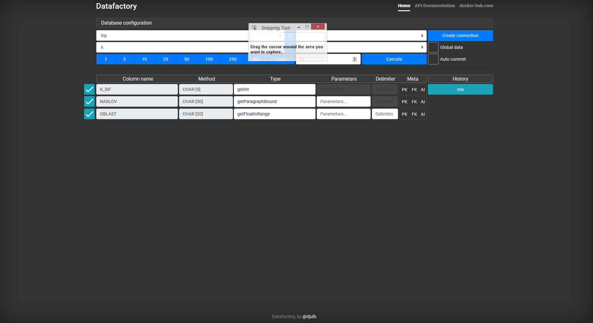

# DataFactory

> Under development

DataFactory exposes [DataLibrary](https://github.com/djulbicb/DataLibrary) as a API service and web app with UI.
<br>These 2 projects are configurable lorem ipsum services that provide random but realistic data.

API service can receive any JSON object and fill it with data (Check example below).<br> 
UI connects with database (just mysql for now) and inserts data into database 

### To do:
- back - when parsing method call replace String param as Object[]
- ui - in ui, on blur check if method exists and select/empty out text field
- back - use less connections when checking for primary and foreign key constraint
- ui - allow disabling a field
- ui - add clear method field in ui
- ui - add on select database remove table selection 
- ui/back - add logging history
- ui/back - save/load
- ui - add execute with with specified number of items
- ui/back - add pick language
- ui - add specify connection
- ui/back - add on error show message
- ui - fix multiple fields being connected 



## API
Send any JSON object to API and it will fill it with random data based on specified method call. For example
```
    {
        "name": "getNameMale()",
        "test": {
        	"testname": "getName()"
        },
        "surname": "getSurname()",
        "age": "getAgeAdult()",
        "country": "getDoubleInRange(10,50)",
        "number":"getIntInRange(1,5)",
        "list": ["loremIpsum()", "loremIpsum()"]
    }
```
and this will return 
```
    {
        "country":48.70817340284648,  
        "number":1,  
        "test":{
	    "testname":"Seymour"  
        },  
        "surname":"Felice",  
        "name":"Manual",  
    "list":[
        "Purus nam.",  
        "Ligula et vitae enim id nulla qui."  
    ],  
        "age":57  
    }
```
Order of properties is not kept at the moment. Here is a test example using PHP    
```
    class Test {
    	public $name;
    	public $surname;
    	public $age;
    	public $address;
    
    	function __construct($name, $surname, $age, $address){
    		$this->name = $name;
    		$this->surname = $surname;
    		$this->age = $age;
    		$this->address = $address;
    	}
    }
    
    $url = 'http://localhost:8091/api/getdata';
    $tastArray = array('key1' => 'getName()', 'key2' => 'getName()');
    $testObj = new Test("getName()", "getSurname()", "getIntInRange(10,15)", "getStreet()") ;
    var_dump($testObj);
    
    echo json_encode($testObj);
    
    $options = array(
      'http' => array(
        'method'  => 'POST',
        'content' => json_encode( $testObj ),
        'header'=>  "Content-Type: application/json\r\n" .
                    "Accept: application/json\r\n"
        )
    );
    
    $context  = stream_context_create( $options );
    $result = file_get_contents( $url, false, $context );
    
    
    $response = json_decode( $result );
    
    
    
    var_dump($response);
    echo $response->name;
    
    
    ?>
```

